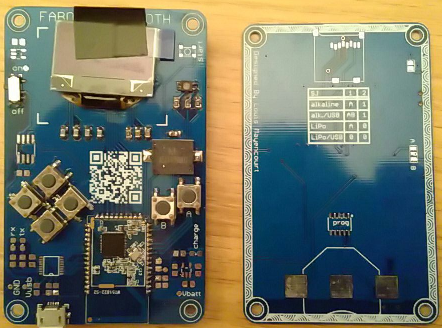
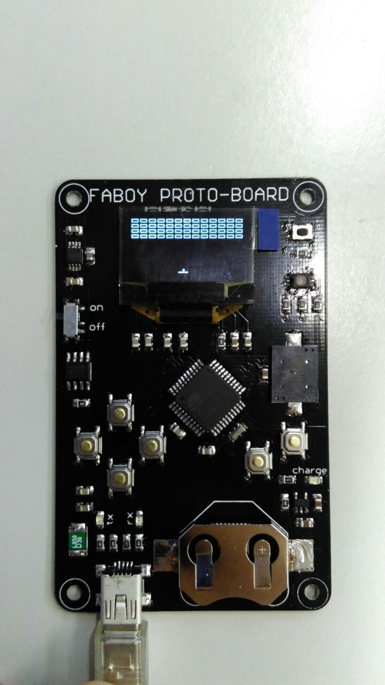
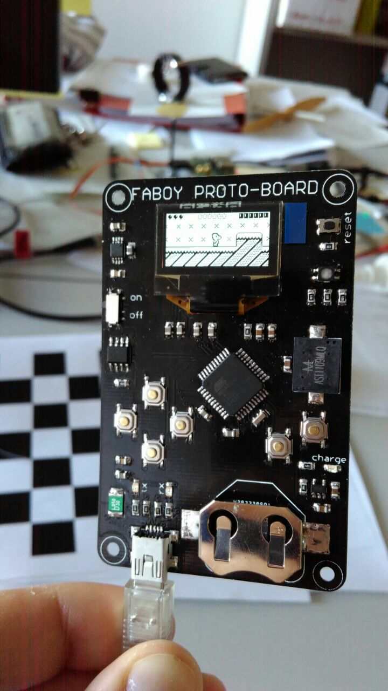

# faboy
arduboy clone for the fablab of Sion (CH)

## faboyBLE (V2)
The new version of the faboy is based on a nrf52822 module, an ARM cortex M0+ based processor with Bluetooth Smart. This will allow the possibility to change game wia BLE or UART and to have multiplayer games.  
### status

* PCB designed, ordered and mounted

### issues 
* cannot programm the nrf module...

## idea for v2 
  * NRF24l for a wireless communication
  * capacitive button
  * coin-cell battery / thin film battery 
  * different switch pattern
  * ARM processor 
  * solar cell
  * PCB usb connector 
  * battery monitoring with ADC

## issues 
  * bad usb connector (mini b instead of micro b !)
  * difficult to find a gnd test pad on the top 
  * battery operation crash after a small moment
